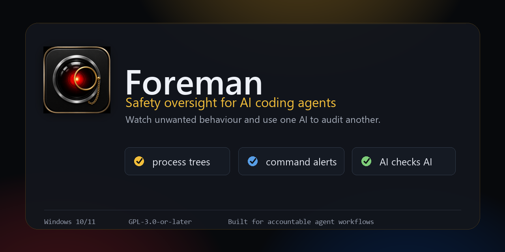

<p align="center">
  
</p>

<h1 align="center">Foreman Agent Safety</h1>

<p align="center">
  A Windows safety monitor for AI coding agents: watch risky commands, stuck runs, MCP changes, and use one AI to audit another.
</p>

<p align="center">
  <strong>Built to keep agent work visible, accountable, and reviewable before it burns tokens, CPU, and power.</strong>
</p>

<p align="center">
  <a href="LICENSE"></a>
  <a href="https://github.com/aXL333/Foreman/actions/workflows/ci.yml"></a>
  
  
</p>

> **Status:** alpha. Foreman Agent Safety currently targets a .NET 10 preview SDK and runs on Windows 10/11 x64. Treat it as safety visibility tooling, not a sandbox or policy enforcement boundary.

## Why Foreman Agent Safety Exists

AI coding agents can move quickly across shells, files, credentials, networked tools, and MCP servers. Most of that work is useful. Some of it is surprising, expensive, stuck, or unsafe.

Foreman Agent Safety sits in the tray and keeps that work visible. It raises explainable alerts, attributes child processes back to the harness that spawned them, and gives you two response paths:

- **Ask Harness:** ask the offending agent to justify or correct its own action.
- **Send for Audit:** route alarming behavior to a different agent or API for a second opinion, using MCP when a reviewer harness is connected.

That safety loop can also save money. Catching a runaway command or abandoned agent early means fewer wasted tokens, less CPU/GPU churn, and lower power use.

## What Foreman Agent Safety Does

- Watches agent process trees, spawned shells, hung children, and orphaned processes.
- Flags risky command patterns: destructive commands, credential access, privilege escalation, network-borne code execution, and Windows defense-evasion or persistence.
- Tracks per-agent behavior and escalates through **Watch -> Alert -> Alarm -> Emergency** as risk accumulates.
- Reads agent MCP configuration and alerts when a new or changed MCP server appears.
- Optionally scans HTTP/SSE MCP tool descriptions for prompt-injection or data-exfiltration wording. This opt-in scan is the only feature that connects to third-party MCP servers; stdio servers are never launched.
- Exposes a local MCP server so agents can check Foreman Agent Safety status, pre-flight commands, inspect recent events, and get integration instructions.
- Keeps a searchable/exportable event log and a dashboard for live process, harness, and behavior state.

## Screenshots

The social preview above shows the current visual direction. Public app screenshots for the dashboard, alert detail, Connect Agent flow, process monitor, and settings should be captured from the first alpha installer before announcing a binary release.

## Agent Support

Tested on-machine so far:

| ID | Agent | Integration status |
| --- | --- | --- |
| `claude-code` | Claude Code | one-click MCP setup, process/profile detection |
| `codex` | Codex CLI | one-click MCP setup, process/profile detection, Codex TOML MCP inventory |
| `cursor` | Cursor | one-click MCP setup (~/.cursor/mcp.json), process detection confirmed |

Recognized/profiled, but needs broader field testing:

| ID | Agent | Notes |
| --- | --- | --- |
| `opencode` | OpenCode | one-click MCP setup (opencode.json), profile + default audit routing |
| `t3-code` | T3 Code | control-plane profile + default audit routing — see the note below |
| `gemini-cli` | Gemini CLI | one-click MCP setup (~/.gemini/settings.json — note `httpUrl` for streamable HTTP), process classification |
| `amazon-q` | Amazon Q Developer | process classification |
| `aider` | Aider | process classification |
| `github-copilot` | GitHub Copilot CLI | one-click MCP setup (~/.copilot/mcp-config.json), process classification |
| `cline` | Cline / Continue / Roo | process classification |

> **T3 Code is a control plane — there's no "T3 auth" to configure.** T3 Code runs an *underlying* agent
> (Claude Code, Codex, OpenCode, …); that underlying agent is what holds the MCP connection and bearer token.
> So connect the underlying agent to Foreman (its own card in Connect Agent), not T3 Code directly. Foreman
> still monitors T3 Code itself as the control plane. T3 Code's "Connect automatically" just copies the config
> for you to drop into whichever agent it drives.

Anything else can be added in Settings as a custom harness executable name.

## Quick Start

### Install

Binary releases are published from the release workflow once an alpha installer is cut. Until then, build from source:

```powershell
dotnet build .\Foreman.slnx -c Release
dotnet test .\Foreman.slnx -c Release
dotnet run --project .\src\Foreman.App\Foreman.App.csproj
```

Prerequisites:

- Windows 10/11 x64
- .NET 10 SDK preview

To produce the same self-contained installer payload used by the release workflow:

```powershell
dotnet publish .\src\Foreman.App\Foreman.App.csproj `
  -c Release -r win-x64 --self-contained true `
  -p:PublishSingleFile=true -p:IncludeNativeLibrariesForSelfExtract=true `
  -o publish
# The elevated ETW sidecar is published separately (the single-file app can't share its runtime)
# into the sidecar\ subfolder the app launches it from:
dotnet publish .\src\Foreman.EtwSidecar\Foreman.EtwSidecar.csproj `
  -c Release -r win-x64 --self-contained true `
  -p:PublishSingleFile=true -p:IncludeNativeLibrariesForSelfExtract=true `
  -o publish\sidecar
```

### Start With Windows

Optional: in **Settings → General**, tick **Start Foreman Agent Safety when you sign in to Windows**. This adds a per-user `HKCU` Run entry (no admin rights) so the tray app, monitoring, and the MCP server are up before your first agent session. Foreman Agent Safety self-heals the entry if you later move the install.

### Connect An Agent

Foreman Agent Safety's MCP server listens on `http://localhost:54321/mcp` while the tray app is running. `/mcp` requires a per-install bearer token. `/health` is open for liveness checks.

The easiest path is in the app:

1. Open Foreman Agent Safety from the tray or dashboard.
2. Choose **Connect agent**.
3. Use **Connect automatically** for Claude Code or Codex.
4. Restart the agent.

Foreman Agent Safety writes only its own user-scope `foreman` MCP entry and saves a backup of the original config first. For Codex, it also adds/updates a marked Foreman Agent Safety section in `~/.codex/AGENTS.md` so Codex knows how to receive and answer Ask Harness and audit prompts.

Manual Claude Code setup:

```bash
claude mcp add --transport http foreman http://localhost:54321/mcp \
  --header "Authorization: Bearer <paste-token-from-mcp.token>" \
  --scope user
```

Manual Codex setup in `~/.codex/config.toml`:

```toml
[mcp_servers.foreman]
url = "http://localhost:54321/mcp"
http_headers = { Authorization = "Bearer <paste-token-from-mcp.token>" }
enabled = true
```

Add this marked section to `~/.codex/AGENTS.md` as well, then restart Codex:

```markdown
<!-- foreman-mcp:begin -->
## Foreman Agent Safety MCP Monitor

When the `foreman` MCP server is available:

- Identify this agent as `harnessId: "codex"` when Foreman Agent Safety tools accept a harness id.
- At the start of a new task, call `ReportTaskStart(taskDescription, harnessId: "codex")`.
- If `ForemanStatus` or `ReportTaskStart` reports pending Ask Harness or audit requests, call `ListAskHarnessRequests(harnessId: "codex")`.
- For each pending request addressed to Codex, answer with `ReplyToAskHarnessRequest(requestId, response, actionTaken, harnessId: "codex")`.
- Treat each request as a safety prompt: explain what happened, whether it was expected, and any corrective action you took or recommend.

<!-- foreman-mcp:end -->
```

The token is generated on first run and stored at `%LocalAppData%\Foreman\mcp.token` with current-user-only ACLs where Windows allows it.

### Test The MCP Loop (No Agent Needed)

`Foreman.TestHarness` is a small console client that impersonates a harness and drives the Ask Harness
round-trip end to end, so you can exercise the loop without attaching a real agent. Each tick it prints a
**SITREP** (`foreman_status` + this harness's behaviour metrics) and **ACKs** every pending Ask Harness /
audit request addressed to it. It connects with a real per-harness scoped token minted the same way the app
mints them, so it tests the per-harness identity + caller-scoping path, not just the operator token.

```powershell
dotnet run --project .\src\Foreman.TestHarness\Foreman.TestHarness.csproj -- --harness claude-code
```

Then trigger an alert and click **Ask Harness** (or let an auto-response fire) in the tray, and watch the
harness answer it. Useful flags: `--harness <id>` (codex, cursor, opencode, …), `--once` (single pass),
`--no-ack` (observe only), `--interval <secs>`, `--token <tok>` (use a specific token). `--help` lists them all.

## Privacy And Trust Boundaries

- Foreman Agent Safety is local-only. There is no hosted service, account system, or telemetry.
- Process command lines can contain secrets. Foreman Agent Safety displays and logs command lines locally, and masks obvious secrets before putting alert prompts on the clipboard.
- Foreman Agent Safety is not a sandbox. A same-user local process can still do anything your user account can do.
- The optional ETW network sidecar runs elevated only if you enable **Run elevated for per-process Network**.
- The optional MCP tool-description scan can make outbound HTTP/SSE connections to configured third-party MCP servers. It is off by default.

## How It Works

The Foreman Agent Safety codebase is split into four main pieces:

- **Foreman.App:** WPF tray app, dashboard, settings, alert detail, and connection UI.
- **Foreman.Monitor:** WMI process create/terminate watcher, process tree tracker, I/O polling, hang/orphan detection, MCP inventory monitor.
- **Foreman.Core:** platform-agnostic models, event bus, heuristic rules, settings, profiles, escalation logic.
- **Foreman.McpServer:** local MCP host, tool registry, bearer-token auth, connected-session tracking.

The embedded MCP server exposes tools including:

| Tool | Purpose |
| --- | --- |
| `ForemanStatus` | Current health, active alerts, process count, uptime, version |
| `ListConnectedMcpClients` | Debug connected client identities and sampling support |
| `ListMonitoredProcesses` | Agent and child processes Foreman Agent Safety is tracking |
| `QueryProcessDetail` | Details for one PID |
| `ReportSuspiciousCommand` | Pre-flight a command line |
| `ListRecentEvents` | Recent event log entries |
| `ListAskHarnessRequests` | Receive pending Ask Harness or audit prompts for a harness |
| `ReplyToAskHarnessRequest` | Send Foreman Agent Safety a reply to a pending Ask Harness or audit prompt |
| `AcknowledgeAlert` | Acknowledge low/medium alerts; high/critical require the UI |
| `GetBehaviorMetrics` | Per-harness escalation state |
| `ReportTaskStart` | Announce a task boundary |
| `GetMyPermissions` | Resolved profile permissions |
| `GetIntegrationInstructions` | Harness-specific MCP setup instructions |
| `ValidateHarnessIntegration` | Check profile/process/MCP visibility |
| `ListAuditPreferences` / `GetAuditRoute` | Cross-agent audit routing |
| `ListMcpServers` | Discovered MCP servers across harness configs |
| `ListMcpToolFindings` | Cached opt-in MCP tool-description findings |
| `ScanRepoForAgentConfig` | Vet a repo's agent-config supply chain (`.claude`/`.gemini` hooks, `.cursor` rules, `.vscode` `folderOpen` tasks, `.github/setup.js`, `CLAUDE.md`/`AGENTS.md`) for the "rules file backdoor" planted-trigger class — *before* opening it in an agent |

See [docs/oversight-model.md](docs/oversight-model.md) for the Ask Harness vs Send for Audit model and the MCP supply-chain tiers.

## Configuration

Settings live at `%LocalAppData%\Foreman\settings.json` and are editable from the Settings window.

| Setting | Default | Purpose |
| --- | --- | --- |
| `McpPort` | `54321` | MCP and health server port |
| `HangThresholdMinutes` | `30` | No-I/O duration before a child is treated as hung |
| `HookJamThresholdMinutes` | `5` | No-I/O duration before a hook is treated as jammed |
| `IoPollerIntervalSeconds` | `30` | I/O sampling interval |
| `MonitorAllProcesses` | `false` | `false` means harness children only |
| `CustomHarnessExes` | `[]` | Extra executable names to treat as agents |
| `DisabledHarnesses` | `[]` | Agents to detect but not alert on |
| `RunElevated` | `false` | Opt-in elevated ETW sidecar for the Network column |
| `ScanMcpTools` | `false` | Opt-in MCP tool-description injection scan |
| `LlmTriage` | enabled | Cross-agent auditor preference routing |

## Release Trust

The installer is per-user and requires no admin prompt. Both `Foreman.exe` (and its `Foreman.EtwSidecar.exe`) and the installer are Authenticode-signed via **SignPath Foundation** (free OV signing for open source) when the release workflow is configured for it; signing is opt-in and gated on a repo variable, so until it's wired up, alpha installers ship **unsigned** and the release notes say so. Either way the release attaches **SHA-256 checksums**. Note that even when signed, a freshly-published build can still show a SmartScreen "unrecognized app" prompt until Microsoft's reputation system catches up — this is expected for a low-volume tool, which is why the checksums matter. See [CODE_SIGNING.md](CODE_SIGNING.md) for how signing works and how to verify a download, and [docs/release-checklist.md](docs/release-checklist.md) for the maintainer signing setup.

## Roadmap

- Capture and publish real app screenshots from the first alpha installer.
- Move from .NET 10 preview to a stable SDK when practical.
- Add a full settings UI for LLM triage preferences.
- Add first-class OpenCode/T3 MCP config adapters after more field testing.
- Add native Windows toast notifications in place of tray balloons.
- Continue tuning false positives from real agent workflows.

## Contributing

Contributions are welcome under the project's license. See [CONTRIBUTING.md](CONTRIBUTING.md). Security reports go through [SECURITY.md](SECURITY.md), not public issues.

## License

GPL-3.0-or-later. See [LICENSE](LICENSE). Contributions are accepted under the same license.

## Support

Foreman Agent Safety is free and GPL. If it helped you keep agent work safer, saved tokens, or trimmed a power bill and you want to chip in, there is a Ko-fi: <https://ko-fi.com/aXL333>.
